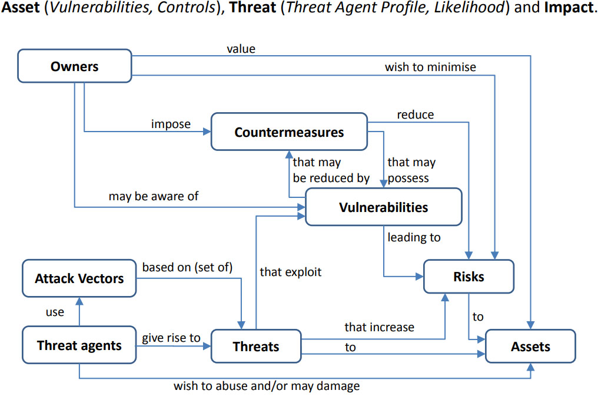

# Embedded Linux Security Inspect

## Общиие концепции

Общие концепции и принципы оценки информационной безопасности представлены в стандартах:

- [ISO/IEC 27001](https://www.iso.org/standard/27001)
- [ISO/IEC 15408-1:2022](https://www.iso.org/obp/ui/en/#iso:std:iso-iec:15408:-1:ed-4:v1:en)
- [CVSS](https://www.first.org/cvss/)
- STRIDE/DREAD

> We have **owners**, those who benefit from a product or service (user, manufacturer, business owner, etc.). Owners want to protect **assets**, anything that has some value in the product or service (data, code, reputation, etc.).\
> Than we have **threat agents**, a person (malicious hacker, government, etc.) that can manifest a **threat**, anything that is capable of acting against an asset in a manner that can result in harm.\
> To manifest a threat, the **threat agents** will explore **vulnerabilities** (weakness in the system) via an **attack vector**, a method or pathway used by the threat agent to access or penetrate the target system.\
> \
> 

С общими подходами по обеспечению безопасности на встраиваемых системах можно ознакомиться здесь:

- [Embedded Linux Conference North America 2020](https://elinux.org/images/1/16/Introduction_embedded_linux_security.pdf)

Отсюда можно выделить следущие направления:

- Secure Boot (однако на СнК i.MX есть [уязвимость](https://blog.quarkslab.com/vulnerabilities-in-high-assurance-boot-of-nxp-imx-microprocessors.html))
- Code and Data Encryption (CAAM module)
  - *dm-crypt*
  - *fscrypt*/eCryptFS
- Static Code analysis
  - Secure Coding
    - buffer overflows (in memory unsafe languages like *C/C++*)
  - *cppcheck*, *splint*, *clang*, etc
  - Runtime Protections
    - *ASLR*/*Valgrind*/*AddressSanitizer*
  - Fuzzing Tools (*syzkaller*/*AFL*)
- Access Control
  - not running with *root* (superuser) privileges
  - Linux capabilities
  - MAC (*SELinux*/*AppArmor*) 
- Application SandBoxing
  - Linux Containers
    - *namespaces*
    - *cgroups*
    - *seccomp*
  - Trusted Execution Environments (TEE).
    - *ARM's TrustZone*
    - *OP-TEE*
- Update System
  - OTA
  - Strategies:
    - Application-based
    - Package-based
    - Image-based
    - Container-based
- Network
  - firewall rules
  - secure connection (VPN, reverse SSH, TLS, HTTPS, etc).

## Security and vulnerability Testing Tools for Web application

1. **OWASP ZAP (Zed Attack Proxy)**
   - **Description**: OWASP ZAP is a **free** tool for scanning vulnerabilities in web applications. It will help you detect vulnerabilities such as SQL injections or cross-site scripts (XSS).
   - **Availability**: Free Open Source app
   - **Use**
     - Есть автоматический скан URL c возможностью запуска атак
     - При помощи HUB можно вручную исследовать уязвимости веб-приложения
     - Генерация HTML-репортов.

2. **Burp Suite**
   - **Description**: Burp Suite is a **commercial** tool for web application security testing. It provides scanning, analysis, and interaction features with applications.
   - **Availability**: Paid app with free Community Edition version

3. **Nessus**
   - **Availability**: Paid app with free 7-day trial period

4. **Netsparker** and  **Acunetix** by *Invicti*
   - **Availability**: Paid app (price upon request)

5. **Snyk**
   - **Availability**: Paid app with free version
